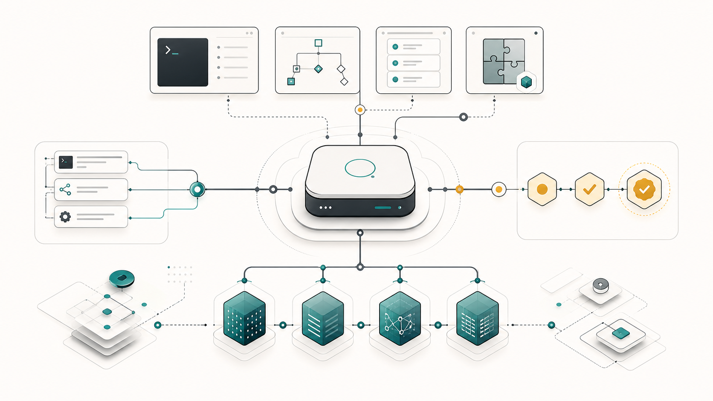

# cyrene-continuity

Local-first continuity and memory plugin for Codex.

[](https://github.com/mingxiangbian/cyrene-continuity/actions/workflows/ci.yml)
[](LICENSE)




## What It Does

- Supplies continuity context to Codex from local project and global memory.
- Keeps memory review-safe with pending candidates, explicit approval, and review-hash validation.
- Exposes MCP tools for continuity reads, memory review, lifecycle feedback, project identity, and project harvesting.
- Includes a CLI and local Web UI for install checks, memory review, maintenance, and diagnostics.
- Ships deterministic benchmark and eval profiles for continuity, safety, retrieval, and release gates.

## Quickstart

Requirements: Node.js `>=22.5.0` and npm `>=10`.

```bash
git clone <repo-url>
cd cyrene-continuity
npm ci
npm run build:plugin
npm run dev -- codex install --plugin
```

Restart Codex so plugin discovery reloads the bundled MCP server, lifecycle
hooks, and skill from `plugin/`.

Then verify the installed stable shim:

```bash
~/.cyrene/codex/bin/cyrene-continuity codex doctor
~/.cyrene/codex/bin/cyrene-continuity codex benchmark run --profile smoke
```

If you previously configured a manual MCP server such as
`[mcp_servers."cyrene-continuity"]` or `[mcp_servers.cyrene]`, disable the
manual entry after the plugin install. The Codex plugin declares its own MCP
server.

For source-checkout development, use the dev bridge and local UI:

```bash
npm run dev -- codex install --dev
npm run dev -- codex doctor
npm run dev -- codex ui
```

## How It Works

Cyrene runs as a Codex plugin with a bundled MCP server, lifecycle hooks, a
skill, a CLI, and a local Web UI. All surfaces share source contracts and local
memory roots. See [docs/ARCHITECTURE.md](docs/ARCHITECTURE.md) for the layer
model, data flow, and runtime boundaries.

## MCP Tool Registry

- Project and continuity: `cyrene_project_identify`, `cyrene_continuity_get`
- Memory proposal and feedback: `cyrene_memory_propose`, `cyrene_memory_harvest_project`, `cyrene_memory_feedback`
- Pending review queue: `cyrene_memory_pending_list`, `cyrene_memory_pending_get`, `cyrene_memory_promote`, `cyrene_memory_reject`, `cyrene_memory_edit`, `cyrene_memory_defer`
- Active memory lifecycle: `cyrene_memory_active_archive`, `cyrene_memory_active_tombstone`, `cyrene_memory_active_propose_edit`, `cyrene_memory_active_supersede`
- Automation and profile: `cyrene_memory_automation_run`, `cyrene_memory_profile_get`

## Safety Model

- Local-first: Cyrene reads and writes memory under `~/.cyrene/codex`; install does not migrate or copy user memory.
- Review queue: ambiguous or high-risk memory remains pending until the user approves, rejects, edits, or defers it.
- Review hash: write actions require the current review hash so stale candidates cannot be approved by accident.
- Fail-open hooks: Codex lifecycle hooks capture local activity signals and review summaries, but failed hook work must not block Codex.
- Active memory boundaries: fast and balanced continuity reads hide pending review content by default; review mode is explicit.

## Benchmark

Local benchmark runs write reports to `benchmark-results/` unless
`--output-dir <path>` is provided. The curated public report for the
2026-06-06 suite lives at
[benchmark/reports/2026-06-06/summary.md](benchmark/reports/2026-06-06/summary.md).

Use the smoke profile for a quick local sanity check:

```bash
~/.cyrene/codex/bin/cyrene-continuity codex benchmark run --profile smoke
```

Use the gate profile before release-facing changes:

```bash
npm run dev -- codex benchmark run --profile gate
```

Archive benchmark artifacts for a curated public report:

```bash
npm run dev -- codex benchmark run --profile gate --artifact-archive-dir benchmark/reports/<date>
```

Benchmark fixtures must use isolated temp HOME, project, memory, and index
paths. They must not read or write real user memory.

## Development

```bash
npm ci
npm test
npm run typecheck
npm run build:plugin
npm run dev -- codex install --dev
npm run dev -- codex doctor
npm run dev -- codex ui
```

For the full command reference, including memory review, lifecycle, benchmark,
eval, project, profile, and similar-hint commands, see
[docs/CLI.md](docs/CLI.md).

## Contributing

Start with [CONTRIBUTING.md](CONTRIBUTING.md), review
[SECURITY.md](SECURITY.md), and check [CHANGELOG.md](CHANGELOG.md). GitHub
templates live under [.github/](.github/), including the
[bug report](.github/ISSUE_TEMPLATE/bug_report.yml),
[feature request](.github/ISSUE_TEMPLATE/feature_request.yml), and
[pull request](.github/pull_request_template.md) templates.
