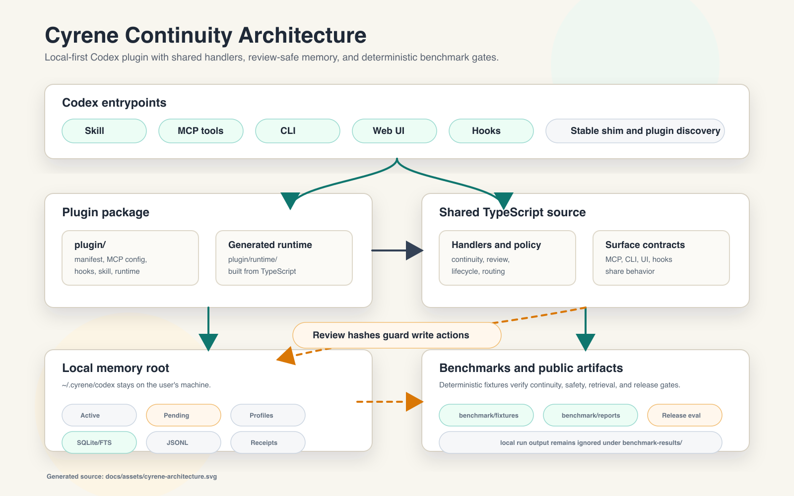

# Architecture

Cyrene Continuity packages local memory, continuity retrieval, review tooling,
and benchmark gates as a Codex plugin. The implementation keeps user memory on
disk, routes write actions through review gates, and builds the plugin runtime
from shared TypeScript source.

## Layers

- Plugin layer: `plugin/.codex-plugin/plugin.json` declares the Codex plugin;
  `plugin/.mcp.json` declares the bundled MCP server; `plugin/hooks/hooks.json`
  declares lifecycle hooks; `plugin/skills/cyrene-continuity/SKILL.md` gives
  Codex usage rules.
- Generated runtime layer: `plugin/runtime/cyrene-continuity.mjs` is built from
  `src/main.ts` and the TypeScript modules under `src/`.
- Source contracts: MCP tools, CLI commands, lifecycle hooks, and the Web UI
  share source handlers and memory policy code instead of separate behavior
  forks.
- Memory layer: project and global memory live under `~/.cyrene/codex`, with
  JSONL audit files, generated profile projections, and a local SQLite/FTS
  retrieval index.
- Benchmark layer: deterministic benchmark and eval code lives under
  `benchmark/`, while local run output goes to `benchmark-results/`.

## Data Flow

1. Codex calls Cyrene through an MCP tool, lifecycle hook, CLI command, or Web UI
   request.
2. The shared source handlers identify the current project, load active project
   and global memory, and apply context-mode policy.
3. Fast and balanced continuity reads return active memory and response strategy
   without pending review content. Review mode can show pending candidates,
   counts, diagnostics, and review metadata.
4. Write paths require current hashes. Pending-memory actions require a
   review hash; active-memory actions require a content hash.
5. Lifecycle automation records auditable receipts and can move only strict
   low-risk memory through named gates. High-risk or ambiguous memory remains in
   manual review.

## Safety Boundaries

Cyrene is local-first. It uses `~/.cyrene/codex` for memory roots and does not
migrate user memory during install.

Pending candidates are not active memory. Approval, rejection, edit, deferral,
profile apply, active-memory archive, tombstone, and supersede flows all check
hashes before writing. Stale hashes fail.

Lifecycle hooks are fail-open for Codex sessions. Hook failures can record
diagnostic summaries, but they must not block Codex work. Hooks can admit only
strict low-risk project memory through explicit policy receipts; high-risk,
ambiguous, personal, relationship, affective, similar-project, and
assistant-observed-only memory stays in manual review.

Fast and balanced context modes hide pending review content by default. Review
mode is required for pending memory review, automation diagnostics, local UI
review, and explicit review requests.

## Generated Runtime

The plugin runtime is generated. Do not hand-edit
`plugin/runtime/cyrene-continuity.mjs`. Update source under `src/`, run
`npm run build:plugin`, then verify the generated runtime diff.

`codex install --plugin` installs the generated runtime bridge and writes the
stable executable shim at `~/.cyrene/codex/bin/cyrene-continuity`. New Codex
sessions then discover the plugin MCP server, hooks, and skill from `plugin/`.

## Benchmark And Reports

Benchmark profiles exercise continuity behavior, review safety, retrieval
routing, lifecycle movement, failure handling, and release gates. Smoke runs are
for fast sanity checks; gate runs are for release-facing validation.

Local benchmark runs write `benchmark_report.json` and `benchmark_report.md` to
`benchmark-results/` unless `--output-dir <path>` is provided. Curated public
reports live under `benchmark/reports/<date>/`; the 2026-06-06 summary is
available at `benchmark/reports/2026-06-06/summary.md`.

Benchmark fixtures must isolate HOME, project roots, memory roots, and indexes.
They must not read or write real user memory.
